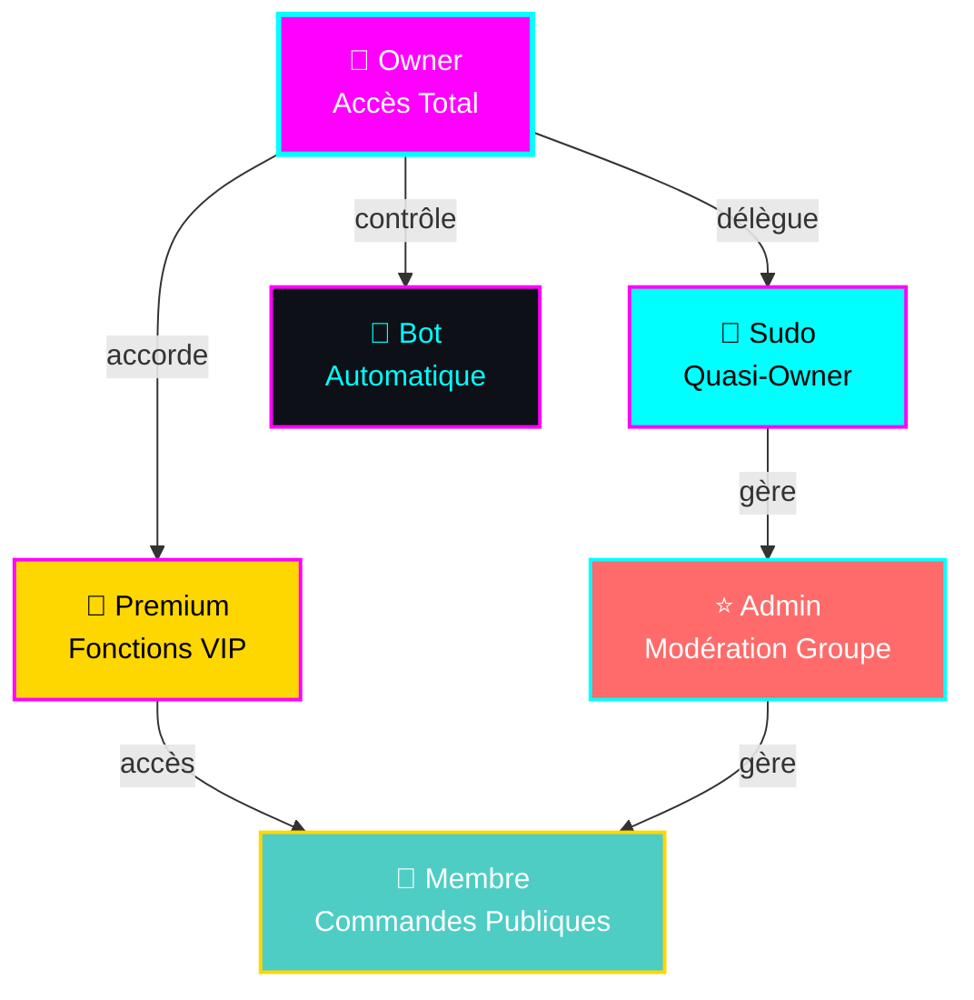

<div align="center">

<!-- HEADER NÉON ANIMÉ -->
<picture>
  <source media="(prefers-color-scheme: dark)" srcset="https://capsule-render.vercel.app/api?type=venom&color=0:ff00ff,50:00ffff,100:ff00ff&height=250&section=header&text=⚡%20LORD%20DEMON%20V2%20⚡&fontSize=55&fontColor=ffffff&animation=twinkling&fontAlignY=35&desc=Bot%20WhatsApp%20Multi-Fonctions%20•%20Baileys%20ESM%20•%20Multi-Session&descSize=14&descAlignY=55&stroke=00ffff&strokeWidth=2">
  
</picture>

<!-- BADGES NÉON -->
[](https://nodejs.org/)
[](https://github.com/WhiskeySockets/Baileys)
[](LICENSE)
[](commands/)
[](https://github.com/ton-repo/lord-demon-v2/releases)

<!-- TYPING ANIMATION -->
<picture>
  <source media="(prefers-color-scheme: dark)" srcset="https://readme-typing-svg.demolab.com?font=Fira+Code&weight=600&size=20&duration=2500&pause=800&color=FF00FF&center=true&vCenter=true&width=700&lines=🤖+Bot+WhatsApp+Multi-Session;⚡+694+Commandes+Disponibles;🛡️+Protection+Avancée+Anti-Spam;🎮+Fun+%2B+Utilitaires+%2B+Médias;👑+Système+Owner%2FSudo%2FPremium;🔐+Sessions+Isolées+par+Utilisateur">
  
</picture>

</div>

---

## 🆕 Multi-Session v2 — Bot-as-a-Service

<div align="center">

| Commande | Description | Permission | Statut |
|:---|:---|:---:|:---:|
| `.pairing +226XXXXXXXX` | Générer un code de pairing pour connecter votre compte | 👤 Membre | 🟢 |
| `.mypair` | Vérifier l'état et les infos de votre session active | 👤 Membre | 🟢 |
| `.stoppair` | Déconnecter et supprimer votre session proprement | 👤 Membre | 🟢 |

</div>

**🔐 Architecture Multi-Session :**
- ✅ `useMultiFileAuthState` par utilisateur avec isolation complète
- ✅ Sessions stockées dans `sessions/{numero}/` (chiffrement local)
- ✅ Reconnexion automatique avec backoff exponentiel
- ✅ Cooldown 60 secondes anti-spam par utilisateur
- ✅ Détection et blocage des sessions dupliquées
- ✅ Restauration automatique des sessions au redémarrage
- ✅ Bot principal totalement indépendant et non affecté

---

## 📋 Commandes Disponibles <sub><sup>`694+`</sup></sub>

<details>
<summary><b>🛡️ Modération</b> <code>9 commandes</code> </summary>

| Commande | Description | Permission | Cooldown |
|:---|:---|:---:|:---:|
| `ban` | Bannir définitivement un utilisateur du groupe | 👑 Owner | 5s |
| `unban` | Révoquer le bannissement d'un utilisateur | 👑 Owner | 5s |
| `kick` | Expulser temporairement du groupe | ⭐ Admin | 3s |
| `warn` | Émettre un avertissement (log + compteur) | ⭐ Admin | 3s |
| `warnlist` | Afficher la liste des avertissements actifs | ⭐ Admin | 0s |
| `resetwarn` | Réinitialiser les warns d'un membre | ⭐ Admin | 3s |
| `promote` | Promouvoir un membre au rang d'admin | ⭐ Admin | 5s |
| `demote` | Rétrograder un admin au rang de membre | ⭐ Admin | 5s |
| `add` | Ajouter un membre au groupe par numéro | ⭐ Admin | 5s |

</details>

<details>
<summary><b>🔒 Protection</b> <code>9 commandes</code> </summary>

| Commande | Description | Détection | Action |
|:---|:---|:---|:---|
| `antilink` | Bloquer les liens externes | Regex URLs | Suppression + Warn |
| `antispam` | Anti-spam intelligent | Fréquence messages | Mute temporaire |
| `antitag` | Bloquer les tags massifs | >5 mentions/group | Suppression + Kick |
| `antimention` | Bloquer mentions non autorisées | Mention owner/admin | Suppression |
| `antiflood` | Anti-flood de messages | >5 msg/3sec | Mute 5min |
| `antiword` | Filtre mots interdits | Liste personnalisable | Suppression + Warn |
| `antipurge` | Anti-suppression massive | >10 suppressions/min | Restauration + Ban |
| `antidemote` | Protection contre démotions | Événement démote | Restauration + Alert |
| `antipromote` | Protection promotions sauvages | Événement promote | Vérification owner |

</details>

<details>
<summary><b>🏠 Groupe</b> <code>12 commandes</code> </summary>

| Commande | Description | Permission |
|:---|:---|:---:|
| `mute` | Rendre le groupe en lecture seule | ⭐ Admin |
| `unmute` | Réactiver les messages | ⭐ Admin |
| `tagall` | Mentionner tous les membres | ⭐ Admin |
| `hidetag` | Tag invisible (notification sans mention) | ⭐ Admin |
| `link` | Obtenir le lien d'invitation du groupe | ⭐ Admin |
| `revoke` | Révoquer et régénérer le lien d'invitation | ⭐ Admin |
| `groupname` | Modifier le nom du groupe | ⭐ Admin |
| `groupdesc` | Modifier la description du groupe | ⭐ Admin |
| `groupphoto` | Changer la photo de profil du groupe | ⭐ Admin |
| `groupinfo` | Afficher les statistiques du groupe | 👤 Membre |
| `open` | Ouvrir le groupe (tous peuvent envoyer messages) | ⭐ Admin |
| `close` | Fermer le groupe (admins uniquement) | ⭐ Admin |

</details>

<details>
<summary><b>ℹ️ Infos</b> <code>8 commandes</code> </summary>

| Commande | Description | Exemple |
|:---|:---|:---|
| `ping` | Latence du bot et uptime | `ping` → `Pong! 45ms` |
| `uptime` | Temps de fonctionnement | `uptime` → `2j 14h 32m` |
| `whoami` | Informations sur vous-même | `whoami` → Profil complet |
| `userinfo` | Infos sur un utilisateur | `userinfo @user` |
| `groupinfo` | Statistiques du groupe actuel | `groupinfo` |
| `listadmin` | Liste des administrateurs | `listadmin` |
| `stats` | Statistiques globales du bot | `stats` |
| `info` | Informations sur LORD DEMON V2 | `info` |

</details>

<details>
<summary><b>🛠️ Outils</b> <code>10 commandes</code> </summary>

| Commande | Description | Input |
|:---|:---|:---|
| `calc` | Calculatrice avancée | `calc 2+2*5` |
| `style` | Styliser du texte (fonts Unicode) | `style Hello` |
| `translate` | Traduction multilingue | `translate fr Hello` |
| `dictionary` | Définition de mots | `dictionary serendipity` |
| `qrcode` | Générer un QR Code | `qrcode https://...` |
| `shorturl` | Raccourcir une URL | `shorturl https://...` |
| `url` | Extraire les métadonnées d'une URL | `url https://...` |
| `ocr` | Reconnaissance de texte sur image | `[image] ocr` |
| `tts` | Text-to-Speech (voix synthétique) | `tts Bonjour` |
| `sticker` | Convertir image/GIF en sticker | `[image] sticker` |

</details>

<details>
<summary><b>🎵 Médias</b> <code>7 commandes</code> </summary>

| Commande | Description | Source |
|:---|:---|:---|
| `song` | Rechercher et télécharger un son | YouTube Music |
| `ytmp4` | Télécharger une vidéo YouTube | YouTube |
| `lyrics` | Paroles de chanson | Genius API |
| `download` | Téléchargeur universel (vidéos) | Multi-source |
| `image` | Recherche d'images | Google Images |
| `vv` | Créer un view-once (disparaît après lecture) | WhatsApp |
| `pp` | Définir photo de profil | WhatsApp |

</details>

<details>
<summary><b>🌤️ Utilitaires</b> <code>7 commandes</code> </summary>

| Commande | Description | Exemple |
|:---|:---|:---|
| `weather` | Météo en temps réel | `weather Paris` |
| `horoscope` | Horoscope quotidien | `horoscope lion` |
| `remind` | Rappel programmé | `remind 30m Appeler maman` |
| `schedule` | Planifier un message | `schedule 20:00 Bonsoir groupe` |
| `notes` | Système de notes persistantes | `notes add idée` |
| `rules` | Afficher les règles du groupe | `rules` |
| `poll` | Créer un sondage | `poll Pizza ou Burger?` |

</details>

<details>
<summary><b>🎮 Fun</b> <code>12 commandes</code> </summary>

| Commande | Description | Joueurs |
|:---|:---|:---:|
| `joke` | Blague aléatoire (FR/EN) | 1 |
| `quote` | Citation inspirante aléatoire | 1 |
| `fact` | Fait insolite aléatoire | 1 |
| `coinflip` | Pile ou face | 1 |
| `dice` | Lancer un dé (1-6) | 1 |
| `choose` | Choisir entre options | 1+ |
| `8ball` | Boule magique 8 | 1 |
| `rps` | Pierre-Papier-Ciseaux | 2 |
| `roast` | Roast humoristique | 1+ |
| `compliment` | Compliment aléatoire | 1+ |
| `tictactoe` | Morpion (Tic-Tac-Toe) | 2 |
| `quiz` | Quiz culture générale | 1+ |

</details>

<details>
<summary><b>📊 Profil</b> <code>6 commandes</code> </summary>

| Commande | Description | Cooldown |
|:---|:---|:---:|
| `daily` | Récompense quotidienne (XP + coins) | 24h |
| `afk` | Mode Absent (message auto) | 0s |
| `rank` | Voir votre niveau et XP | 0s |
| `leaderboard` | Classement global du groupe | 10s |
| `profile` | Voir votre profil complet | 0s |
| `pseudo` | Changer votre pseudo affiché | 5min |

</details>

<details>
<summary><b>👑 Owner</b> <code>20 commandes</code> </summary>

| Commande | Description | Risque |
|:---|:---|:---:|
| `broadcast` | Message de diffusion à tous les chats | ⚠️ Haut |
| `setsudo` | Nommer un utilisateur Sudo | ⚠️ Haut |
| `delsudo` | Révoquer le statut Sudo | ⚠️ Haut |
| `listsudo` | Liste des utilisateurs Sudo | 🟢 Faible |
| `setpremium` | Accorder le statut Premium | ⚠️ Moyen |
| `delpremium` | Révoquer le statut Premium | ⚠️ Moyen |
| `dit` | Faire parler le bot (impersonation) | ⚠️ Moyen |
| `setprefix` | Changer le préfixe global | ⚠️ Haut |
| `setmode` | Mode public/private/group | ⚠️ Haut |
| `botname` | Changer le nom d'affichage du bot | 🟢 Faible |
| `maintenance` | Activer/désactiver la maintenance | ⚠️ Haut |
| `backup` | Sauvegarder les données JSON | 🟢 Faible |
| `restore` | Restaurer depuis une sauvegarde | ⚠️ Haut |
| `stop` | Arrêter le bot proprement | ⚠️ Haut |
| `restart` | Redémarrer le bot | ⚠️ Haut |
| `eval` | Exécuter du code JavaScript | 🔴 Critique |
| `exec` | Exécuter des commandes shell | 🔴 Critique |
| `logs` | Consulter les logs système | ⚠️ Moyen |
| `modlog` | Historique des modérations | 🟢 Faible |
| `clearstats` | Réinitialiser les statistiques | ⚠️ Haut |

</details>

---

## 🔑 Hiérarchie des Permissions

<div align="center">



| Niveau | Badge | Rôle | Commandes Exclusives |
|:---:|:---:|:---|:---|
| 👑 |  | **Owner** | `eval`, `exec`, `broadcast`, `backup`, `restore`, `stop`, `restart`, `setprefix`, `setmode` |
| 🔑 |  | **Sudo** | `setsudo`, `setpremium`, `maintenance`, `logs`, `modlog` |
| 💎 |  | **Premium** | `song`, `ytmp4`, `lyrics`, `download`, `image` |
| ⭐ |  | **Admin** | `kick`, `warn`, `promote`, `demote`, `mute`, `tagall`, `groupname` |
| 👤 |  | **Membre** | `ping`, `calc`, `joke`, `weather`, `profile`, `daily` |

</div>

---

## ⚙️ Configuration `.env`

```env
# ╔═══════════════════════════════════════════════════════════════╗
# ║                    LORD DEMON V2 — CONFIGURATION               ║
# ╚═══════════════════════════════════════════════════════════════╝

# === OBLIGATOIRE ===
OWNER_NUMBER=226XXXXXXXX@c.us    # Votre numéro WhatsApp (format international)

# === GÉNÉRAL ===
PREFIX=.                          # Préfixe des commandes (défaut: .)
MODE=public                       # public | private | group
BOT_NAME=LORD DEMON               # Nom d'affichage du bot

# === MODÉRATION ===
MAX_WARNS=3                       # Nombre de warns avant expulsion auto
WARN_EXPIRE=604800000             # Expiration des warns (7 jours en ms)

# === PROTECTION ===
ANTILINK=true                     # Activer anti-liens
ANTISPAM=true                     # Activer anti-spam
ANTIFLOOD_THRESHOLD=5             # Messages max avant flood
ANTIFLOOD_WINDOW=3000             # Fenêtre de temps flood (3s)

# === MULTI-SESSION ===
SESSION_PATH=./sessions           # Dossier racine des sessions
SESSION_TTL=86400000              # TTL session inactive (24h)
PAIRING_COOLDOWN=60000            # Cooldown pairing (60s)

# === CACHE & PERF ===
CACHE_TTL=300000                  # Cache groupMetadata (5min)
CACHE_MAX_SIZE=1000               # Taille max cache

# === LOGS ===
LOG_LEVEL=info                    # debug | info | warn | error
LOG_FILE=./logs/lord-demon.log    # Fichier de logs
```

---

## 📁 Architecture du Projet

```
⚡ LORD DEMON V2
│
├── 📄 index.js                    # Point d'entrée principal (ESM)
├── ⚙️  config.js                  # Configuration centralisée
├── 🔐 .env                        # Variables d'environnement
│
├── 📂 commands/                   # 694+ commandes modulaires
│   ├── 🛡️  moderation/            # Ban, kick, warn, promote...
│   ├── 🔒 protection/             # Antilink, antispam, antiflood...
│   ├── 🏠 group/                  # Mute, tagall, groupinfo...
│   ├── ℹ️  info/                  # Ping, stats, whoami...
│   ├── 🛠️  tools/                 # Calc, translate, qrcode...
│   ├── 🎵 media/                  # Song, ytmp4, lyrics...
│   ├── 🌤️  utilities/             # Weather, remind, notes...
│   ├── 🎮 fun/                    # Joke, rps, tictactoe...
│   ├── 📊 profile/                # Daily, rank, leaderboard...
│   └── 👑 owner/                  # Broadcast, eval, exec...
│
├── 📂 lib/                        # Bibliothèques core
│   ├── ownerSystem.js            # 👑 Gestion Owner/Sudo/Premium
│   ├── groupConfig.js            # 🏠 Config groupes + cache meta
│   ├── sendMessage.js            # 📤 Wrapper envoi Baileys
│   ├── animLoader.js             # ✨ Loaders animés néon
│   ├── spamManager.js            # 🛡️ Détection anti-spam
│   ├── antiLinkManager.js        # 🔗 Analyse et blocage liens
│   ├── pairingSystem.js          # 🔐 Génération codes pairing
│   └── sessionManager.js         # 🔄 Gestion multi-sessions
│
├── 📂 sessions/                   # 🔐 Sessions utilisateurs
│   └── {numero}/
│       ├── creds.json
│       └── app-state-sync-key...
│
├── 📂 data/                       # 💾 Persistance JSON
│   ├── users.json                # Profils, XP, coins
│   ├── groups.json               # Config groupes
│   ├── warns.json                # Historique warns
│   └── backups/                  # Sauvegardes auto
│
└── 📂 logs/                       # 📝 Logs système
    └── lord-demon.log
```

---

## 🧠 Spécifications Techniques

<div align="center">

| Caractéristique | Implémentation | Performance |
|:---|:---|:---:|
| **Runtime** | Node.js 18+ ESM | 🟢 Optimisé |
| **Librairie** | `@whiskeysockets/baileys` latest | 🟢 Stable |
| **Cache** | `groupMetadata` 5min LRU | 🟢 Évite 429 |
| **Authentification** | `useMultiFileAuthState` + LID | 🟢 Sécurisé |
| **Sessions** | Isolation par dossier `{numero}/` | 🟢 Scalable |
| **Reconnexion** | Exponential backoff (max 5min) | 🟢 Robuste |
| **Persistance** | JSON natif (zero-dependency) | 🟢 Léger |
| **Anti-Spam** | Token bucket algorithm | 🟢 Efficace |

</div>

---

## 🚀 Installation Rapide

```bash
# ╔═══════════════════════════════════════════════════════════════╗
# ║              LORD DEMON V2 — GUIDE D'INSTALLATION              ║
# ╚═══════════════════════════════════════════════════════════════╝

# 1. Cloner le dépôt
git clone https://github.com/ton-repo/lord-demon-v2.git
cd lord-demon-v2

# 2. Installer les dépendances
npm install

# 3. Configurer les variables d'environnement
cp .env.example .env
nano .env  # ← Remplissez OWNER_NUMBER obligatoirement

# 4. Rendre le script exécutable et lancer
chmod +x start.sh
./start.sh

# 🎉 Le bot est en ligne ! Scannez le QR Code ou utilisez le pairing.
```

---

## 🐛 Dépannage

<details>
<summary><b>Erreur "Session invalide"</b></summary>

```bash
# Supprimer la session corrompue et reconnecter
rm -rf sessions/{numero}/
# Puis relancer ./start.sh
```
</details>

<details>
<summary><b>Erreur 429 (Rate Limit)</b></summary>

Le cache `groupMetadata` est automatique. Si persistant :
```bash
# Augmenter le TTL dans .env
CACHE_TTL=600000  # 10 minutes
```
</details>

<details>
<summary><b>Node.js version incompatible</b></summary>

```bash
# Vérifier la version
node -v  # Doit être >= 18.0.0

# Mettre à jour via nvm
nvm install 20
nvm use 20
```
</details>

---

<div align="center">

## 👤 Créateur

<picture>
  <source media="(prefers-color-scheme: dark)" srcset="https://readme-typing-svg.demolab.com?font=Fira+Code&weight=700&size=28&duration=2000&pause=500&color=FF00FF&center=true&vCenter=true&width=400&lines=👑+LORD+DEMON+👑">
  
</picture>

**Développeur & Architecte — LORD DEMON V2**

[](https://github.com/lord-demon)
[](https://wa.me/226XXXXXXXX)

*"Code is poetry. Bots are art."* ⚡

---

<picture>
  <source media="(prefers-color-scheme: dark)" srcset="https://capsule-render.vercel.app/api?type=waving&color=0:00ffff,50:ff00ff,100:00ffff&height=120&section=footer&text=⚡%20LORD%20DEMON%20V2%20•%20Tous%20droits%20réservés%20⚡&fontSize=16&fontColor=ffffff&animation=fadeIn">
  
</picture>

</div>
